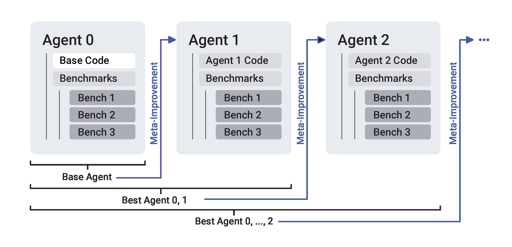

<p align="center">
  <h1 align="center">💰 Money Making Lifeforms 🧬</h1>
  <p align="center">AI agents that evolve trading strategies through natural selection.</p>
  <p align="center">
    
  </p>
</p>

⚠️ **This is a fork** of [self_improving_coding_agent](https://github.com/MaximeRobeyns/self_improving_coding_agent).

## The Concept

**What if trading strategies evolved like biological organisms, with no human bias about what "should" work?**

This system implements **evolutionary natural selection** for trading strategies using an abstract symbolic language with **no predefined technical indicators**. Fitness is purely economic:

```
Fitness = Trading Profit - Transaction Costs - LLM API Costs (optional)
```

**If Fitness ≤ 0, the strategy dies. If Fitness > Parent Fitness, it survives and propagates.**

### The "Petri Dish" Metaphor

Like biological experiments in petri dishes, strategies evolve in isolated experimental environments called **dishes**. Each dish is a named long-running evolution experiment with:

- Persistent cell database tracking lineage
- Multi-generation evolution
- Pattern discovery across populations
- Economic survival pressure

Strategies that generate profit survive and mutate. Those that don't are discarded but analyzed for failure patterns.

### Abstract Symbolic Language (Zero Human Bias)

Instead of using human-designed indicators like RSI or MACD, strategies use meaningless symbols:

```
IF ALPHA(10) > BETA(50) THEN BUY ELSE SELL
IF GAMMA(14) < DELTA(20) THEN BUY ELSE HOLD
IF DELTA(0) > DELTA(20) AND EPSILON() > 1000 THEN BUY ELSE SELL
```

**The symbols have no predefined meaning.** The agent doesn't "know" that moving averages exist or that "oversold" is a concept. It must discover profitable patterns through pure trial and error—natural selection with zero priors.

Symbols map to OHLCV data internally, but the evolution process has no knowledge of this mapping.

See [`cursor_docs/DSL_DESIGN.md`](cursor_docs/DSL_DESIGN.md) for the philosophical rationale.

## How It Works

```
┌──────────────────────────────────────────────────────────┐
│                  EVOLUTIONARY CYCLE                      │
└──────────────────────────────────────────────────────────┘

1. Generate/mutate DSL trading strategy
   ↓
2. Test on multi-timeframe backtest (1h, 4h, 1d)
   ↓
3. Calculate fitness:
   - Best timeframe profit
   - Minus transaction costs (0.045% per trade)
   - Minus LLM costs (if using cloud LLM)
   ↓
4. Survival check:
   - Fitness > Parent? → Birth new CELL, continue evolution
   - Fitness ≤ Parent? → Record failure, try again
   ↓
5. Pattern discovery (LLM analyzes successful cells)
   ↓
6. Intelligent mutation (LLM proposes improvements)
   ↓
7. Repeat from step 1
```

**No gradients. No supervised learning. No human trading folklore.**

Just mutation, selection, and survival of the economically fit.

## Quick Start 🚀

### 1. Setup

```bash
# Clone the repo
git clone https://github.com/YOUR_USERNAME/money_making_lifeforms
cd money_making_lifeforms

# Install dependencies
pip install -r base_agent/requirements.txt

# Optional: Install Ollama for FREE local LLM (recommended!)
# https://ollama.ai
ollama pull gemma2:27b-instruct-q4_K_M

# Export API key if using cloud LLM
export ANTHROPIC_API_KEY=your_key_here  # Or other providers
```

### 2. Try It Out

**Demo Mode** (No costs, explains the system):
```bash
./trade demo
```

**Test a Single Strategy** (No costs):
```bash
./trade test --strategy "IF DELTA(0) > DELTA(20) THEN BUY ELSE SELL"
```

**Pure Genetic Evolution** (No LLM, completely free):
```bash
./trade evolve --dish my_experiment --generations 100
```

**LLM-Guided Learning** (Intelligent mutations, ~$0.0001/iteration with local LLM):
```bash
# With local LLM (FREE!)
USE_LOCAL_LLM=true ./trade learn --dish smart_experiment --iterations 100

# Or with cloud LLM
./trade learn --dish smart_experiment --iterations 10
```

**Web Dashboard** (Real-time monitoring):
```bash
./trade web &
# Open http://localhost:8081
```

### 3. Monitor Progress

```bash
# View top performing cells
./trade query top-cells --limit 10

# List all experiments
./trade list-dishes

# Query specific cell lineage
./trade query lineage --cell-id 42
```

## Evolution Modes

### Pure Genetic Evolution (Free!)

Random mutations with natural selection—no LLM costs:

```bash
./trade evolve --dish baseline_experiment --generations 100 --fitness-goal 50.0
```

**How it works:**
1. Generation 0 creates a random strategy
2. Each generation:
   - Backtests current strategy on 1h, 4h, 1d timeframes
   - Calculates aggregate fitness
   - If fitness > parent, births new cell
   - Randomly mutates: change operators, symbols, parameters, actions
3. Stores all cells in `experiments/<dish>/evolution/cells.db`

**Best for:** Building a diverse population of strategies for later LLM analysis.

### LLM-Guided Learning (Intelligent)

The LLM analyzes successful strategies and proposes intelligent mutations:

```bash
# Local LLM (FREE with Ollama!)
USE_LOCAL_LLM=true ./trade learn --dish smart_evolution --iterations 100

# Cloud LLM (costs ~$0.02-0.10 per iteration)
./trade learn --dish smart_evolution --iterations 10 --cost-threshold 1.0
```

**How it works:**
1. **Pattern Discovery**: LLM analyzes top cells and identifies successful patterns
2. **Intelligent Mutation**: LLM proposes targeted mutations with rationale
3. **Validation**: Proposed strategy is parsed and backtested
4. **Selection**: Only mutations that beat parent fitness are saved
5. **Learning**: System learns from both successes and failures

**Best for:** Exploiting discovered patterns and refining strategies.

## Key Features

### 🧬 Cell-Based Evolution

Strategies are stored as **cells** with full lineage tracking:

```
Cell #101 (Gen 0)  [$65.35]
  └─> Cell #102 (Gen 1)  [$72.50]  ✓ Improvement!
       └─> Cell #103 (Gen 2)  [$85.20]  ✓ Improvement!
```

- Persistent SQLite database
- Parent-child relationships
- Multi-timeframe phenotypes
- Failed mutation tracking

### 🔬 Petri Dish Experiments

Named experiments for long-running evolution:

```bash
./trade evolve --dish PURR_Baseline_1 --generations 1000
./trade evolve --dish BTC_Momentum --generations 500
./trade learn --dish PURR_Baseline_1 --iterations 100  # Resume!
```

Each dish maintains its own cell database and can be resumed anytime.

### 📊 Multi-Timeframe Testing

Every strategy is tested on multiple timeframes simultaneously:

```
Multi-timeframe backtest results:
  1h: $-36.49 profit, 5 trades, 100.0% win rate
✓ 4h: $11.46 profit, 7 trades, 66.7% win rate    ← Best!
  1d: $-45.88 profit, 0 trades, N/A win rate

Fitness: $11.46 (best timeframe selected)
```

Prevents overfitting to a single timescale.

### 🤖 Local LLM Support (FREE!)

Use Ollama for zero-cost intelligent mutations:

```bash
# Install Ollama
ollama pull gemma2:27b-instruct-q4_K_M

# Run with local LLM
USE_LOCAL_LLM=true ./trade learn --dish free_learning --iterations 1000
```

No API costs, complete privacy, unlimited iterations!

### 🧠 Pattern Discovery

LLM analyzes top-performing cells to identify successful patterns:

```
🔍 DISCOVERED PATTERNS:
   - momentum_reversal (Technical): Using recent price momentum
     with reversal detection
     Used by 15 cells

   - volume_confirmation (Market Structure): High volume confirms
     directional moves
     Used by 23 cells
```

These patterns guide future intelligent mutations.

### 📈 Web Dashboard

Real-time evolution monitoring at `http://localhost:8081`:

- Live fitness progression
- Cell lineage trees
- Multi-timeframe performance
- Pattern discovery results
- Run/pause evolution controls

## System Architecture

### Core Components

```
money_making_lifeforms/
├── base_agent/
│   ├── src/
│   │   ├── dsl/
│   │   │   ├── grammar.py         # Abstract symbolic language
│   │   │   ├── interpreter.py     # Strategy parser & executor
│   │   │   └── mutator.py         # Random mutation logic
│   │   ├── storage/
│   │   │   ├── cell_repository.py # Cell database interface
│   │   │   └── models.py          # Cell/Phenotype data models
│   │   ├── analysis/
│   │   │   ├── pattern_discovery.py    # LLM pattern analysis
│   │   │   └── mutation_proposer.py    # Intelligent mutations
│   │   ├── data/
│   │   │   └── hyperliquid_fetcher.py  # Market data API
│   │   ├── trading/
│   │   │   └── trading_evolution.py    # Evolution orchestration
│   │   └── benchmarks/
│   │       └── trading_benchmarks/
│   │           └── trading_benchmark.py # Fitness evaluation
│   └── tests/                      # Comprehensive test suite
├── experiments/                    # Petri dish databases
│   └── <dish_name>/
│       └── evolution/
│           └── cells.db           # Cell lineage & phenotypes
├── trading_cli.py                 # Main CLI interface
├── trading_api.py                 # Web dashboard server
├── trade                          # Convenience wrapper script
└── cursor_docs/                   # Documentation
    ├── DSL_DESIGN.md
    ├── EVOLUTIONARY_LOOP.md
    └── DOCKER_COMMANDS.md
```

### Database Schema

**Cells Table:**
- `cell_id` - Unique identifier
- `generation` - Generation number
- `parent_cell_id` - Parent cell (null for Gen 0)
- `dsl_genome` - Strategy DSL string
- `fitness` - Aggregate fitness score
- `status` - 'online' (survived) or 'offline' (died)
- `dish_name` - Experiment name

**Phenotypes Table:**
- Multi-timeframe performance data
- Per-timeframe profit, trades, win rate
- Sharpe ratio, max drawdown

**Failed Mutations Table:**
- Tracks unsuccessful mutations
- Helps LLM avoid repeated failures

## Commands Reference

```bash
# Evolution
./trade evolve -g 100 -d my_dish          # Pure genetic evolution
./trade evolve -g 1000 -f 50.0            # Run until fitness hits $50

# LLM-Guided Learning
./trade learn -n 10 -d smart_dish         # Cloud LLM
USE_LOCAL_LLM=true ./trade learn -n 100   # Local LLM (free!)

# Testing
./trade test --strategy "IF ..."          # Test single strategy
./trade demo                               # Demo mode

# Database Queries
./trade query top-cells -l 10             # Top performers
./trade query lineage -c 42               # Cell ancestry
./trade query failed-mutations -c 42      # What didn't work

# Monitoring
./trade list-dishes                        # List experiments
./trade web                                # Start web UI

# Help
./trade --help                             # Show all commands
./trade evolve --help                      # Command-specific help
```

## Research Directions

### Evolution & Learning
- [ ] **Crossover breeding**: Combine strategies from multiple cell lineages
- [ ] **Adaptive mutation rates**: Increase diversity when stuck
- [ ] **Multi-objective optimization**: Balance profit, risk, Sharpe ratio
- [ ] **Population diversity metrics**: Maintain genetic variety

### LLM Integration
- [x] Pattern discovery across cell populations ✓
- [x] Intelligent mutation proposals ✓
- [x] Local LLM support (Ollama) ✓
- [ ] Strategy explanation and decomposition
- [ ] Transfer learning across markets
- [ ] Self-modifying DSL grammar

### Market Integration
- [x] Multi-timeframe backtesting ✓
- [x] Real market data (Hyperliquid API) ✓
- [ ] Multi-asset evolution (BTC, ETH, SOL, PURR)
- [ ] Live paper trading integration
- [ ] Real capital deployment (at your own risk!)

### System Improvements
- [x] Cell-based storage with lineage ✓
- [x] Petri dish experiments ✓
- [x] Web dashboard ✓
- [ ] Distributed evolution (multiple workers)
- [ ] GPU-accelerated backtesting
- [ ] Advanced risk metrics (CVaR, Kelly criterion)

## Documentation

Detailed guides in [`cursor_docs/`](cursor_docs/):

- **[DSL_DESIGN.md](cursor_docs/DSL_DESIGN.md)** - Philosophy: Why abstract symbols?
- **[EVOLUTIONARY_LOOP.md](cursor_docs/EVOLUTIONARY_LOOP.md)** - How evolution works
- **[DOCKER_COMMANDS.md](cursor_docs/DOCKER_COMMANDS.md)** - Docker reference
- **[TESTING.md](cursor_docs/TESTING.md)** - Testing guide

## Warning ⚠️

**This is experimental software that executes trading strategies. It is for research and educational purposes only.**

- Uses historical backtesting, not real trading
- No guarantees of profitability
- Evolved strategies may overfit to training data
- Past performance does not indicate future results
- Use at your own risk if deploying with real capital

**The "survival" mechanism is a research metaphor for economic constraints, not financial advice.**

## Citation & Attribution

### This Fork

This "Money Making Lifeforms" fork explores evolutionary trading with abstract symbolic languages:

```bibtex
@misc{money_making_lifeforms_2025,
    title={Money Making Lifeforms: Evolutionary Trading with Economic Survival Constraints},
    author={[Your Name]},
    year={2025},
    note={Fork of SICA with cell-based evolution and LLM-guided learning},
    url={https://github.com/YOUR_USERNAME/money_making_lifeforms}
}
```

### Original Work

Based on the SICA (Self-Improving Coding Agent) framework:

```bibtex
@inproceedings{
    robeyns2025sica,
    title={{SICA} A Self-Improving Coding Agent},
    author={Maxime Robeyns, Martin Szummer, and Laurence Aitchison},
    booktitle={ICLR 2025 Workshop on Scaling Self-Improving Foundation Models},
    year={2025},
    url={https://openreview.net/forum?id=rShJCyLsOr}
}
```

Original repository: [github.com/MaximeRobeyns/self_improving_coding_agent](https://github.com/MaximeRobeyns/self_improving_coding_agent)

---

**"Nature doesn't know about RSI or MACD. Let's give the agents the same freedom."** 🧬
